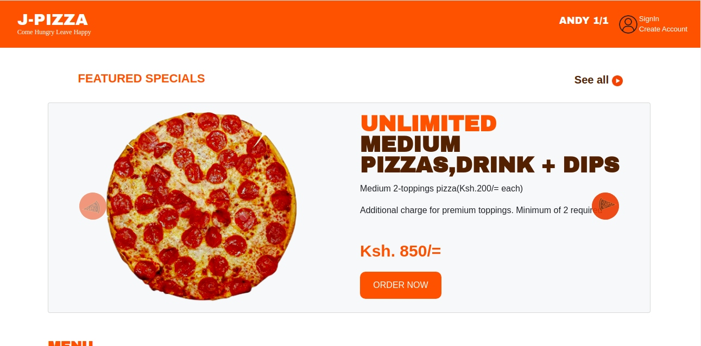

# PIZZA WEB APPLICATION

This is a web application that allows customers and pizza lovers
to order pizza online and late delivered to them wherever they are.

## AUTHOR
[Andrew John](https://andyjohn23.github.io/portfolio-repo/)

## SNEAK PEAK

[J-PIZZA](https://andyjohn23.github.io/andy-pizza/.)

## SETUP INSTRUCTIONS

1. open the terminal(ctrl + alt + T)
1. git clone https://github.com/andyjohn23/andy-pizza
1. cd andy-pizza
1. code . in the terminal to open visual studio code

## BDD
1. Browse the site online.
1. navigate to menu section and view various pizza flavours
1. Click on an order now button which will take you to order page
1. on order page you will select pizza flavour, toppings, crust and many more.
1. place order and provide delivery address for fast delivery. 

## TECHNOLOGY USED
1. HTML
1. CSS
1. BOOTSTRAP
1. JAVASCRIPT

## CONTACT INFORMATION
For any queries contact [andrewnick906@gmail.com]

## LICENSE AND COPYRIGHT
* MIT LICENSE
* Copyright@2020 Andrew John 
